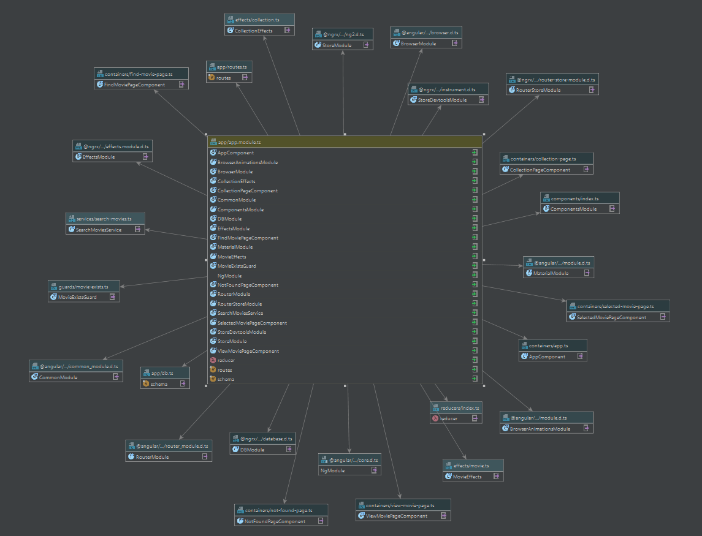
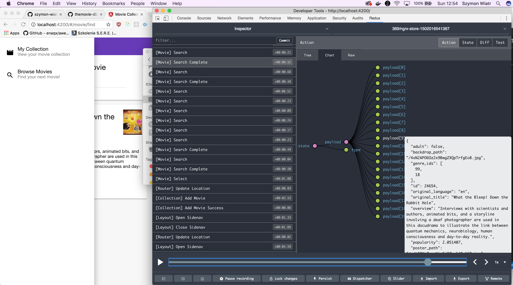
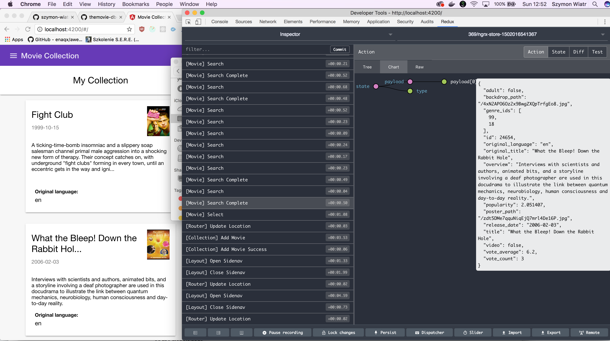
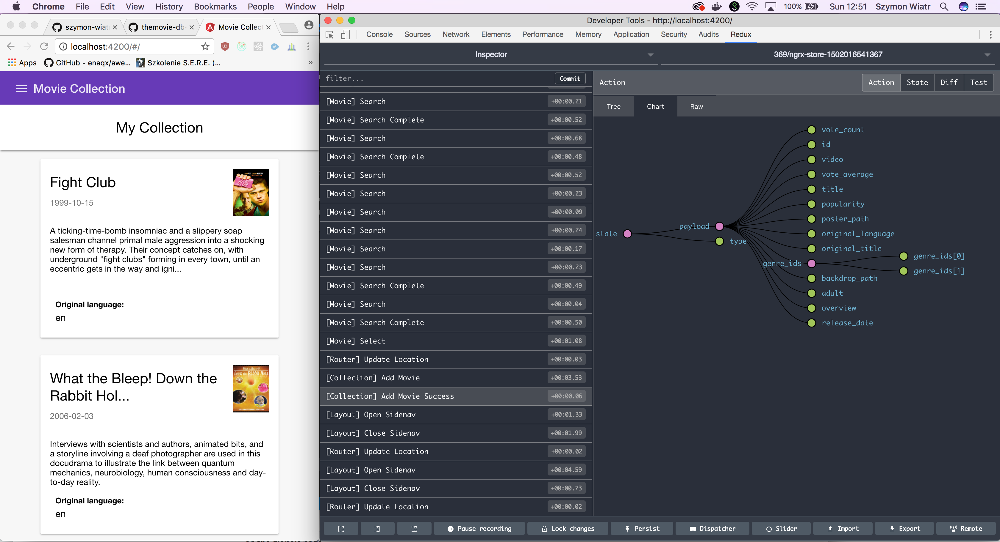
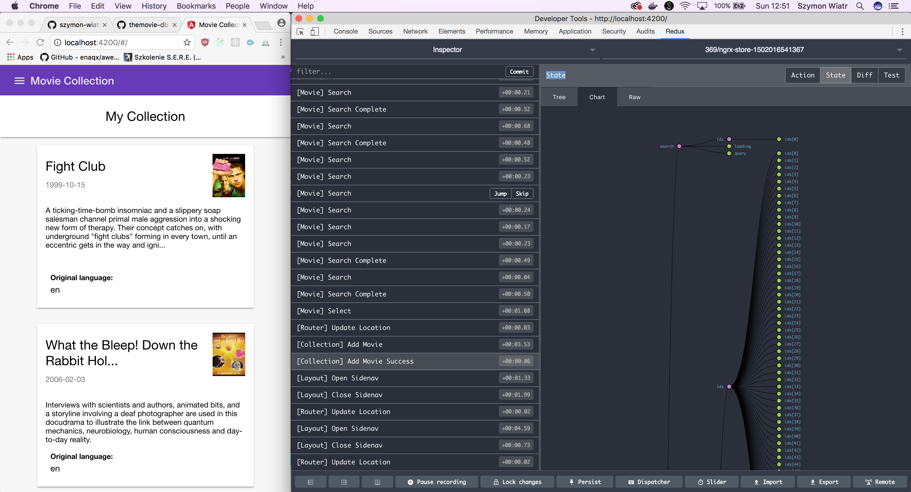
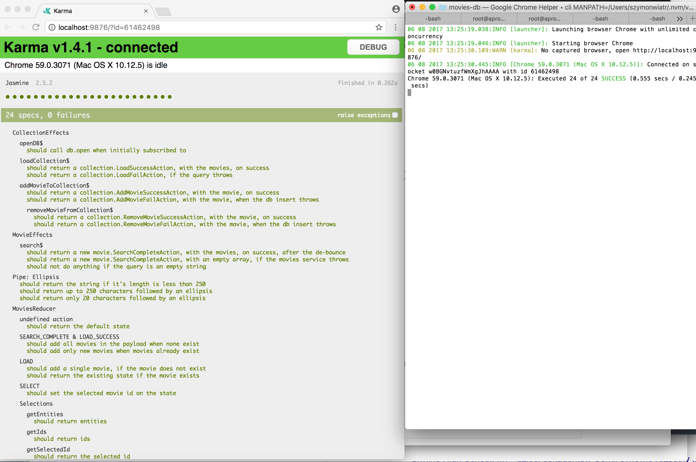

# @movies db search app

Goal was to use Functional & Functional Reactive Programming, got immutable state with redux,
avoid for loop and if statements.

I've preffered TypeScript to got better IDE support and code maintenance.
Angular.io with TypeScript got IoC / rebuilded, better DI mechanism









There is Just In Time  JIT Complier for the Development,
And Ahead of Time AOT compiler with tree shaking for production.

App in development version is running at : 

[http://188.116.12.120:8080/](http://188.116.12.120:8080/)

# change directory to repo
cd themovie-db-search

# Use npm or yarn to install the dependencies:
npm install

# OR
yarn

# start the server
Please ensure that you've got installed ng cli
ng serve

You can run unit test with $ng test



```


Navigate to [http://localhost:4200/](http://localhost:4200/) in your browser

Tested on Win7 & OS X 


